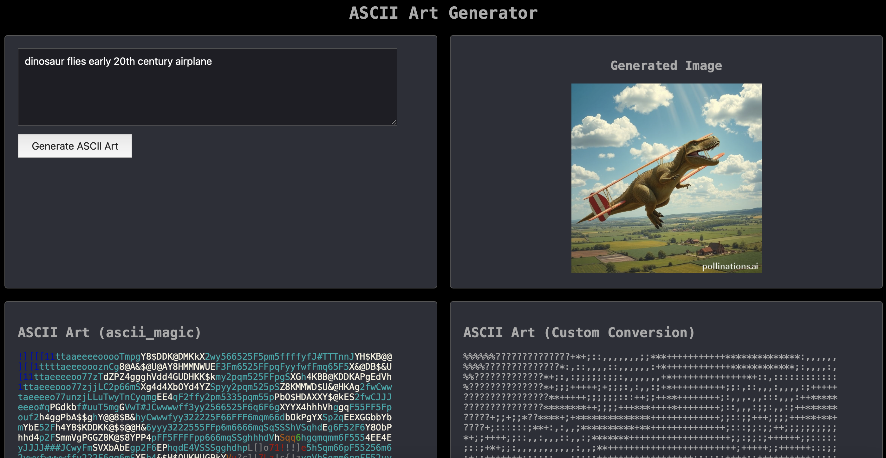
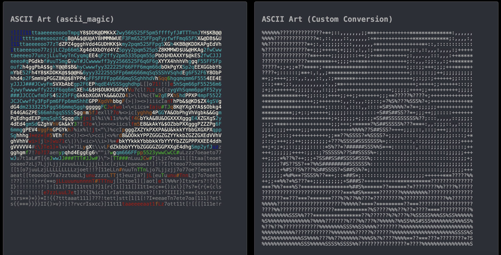
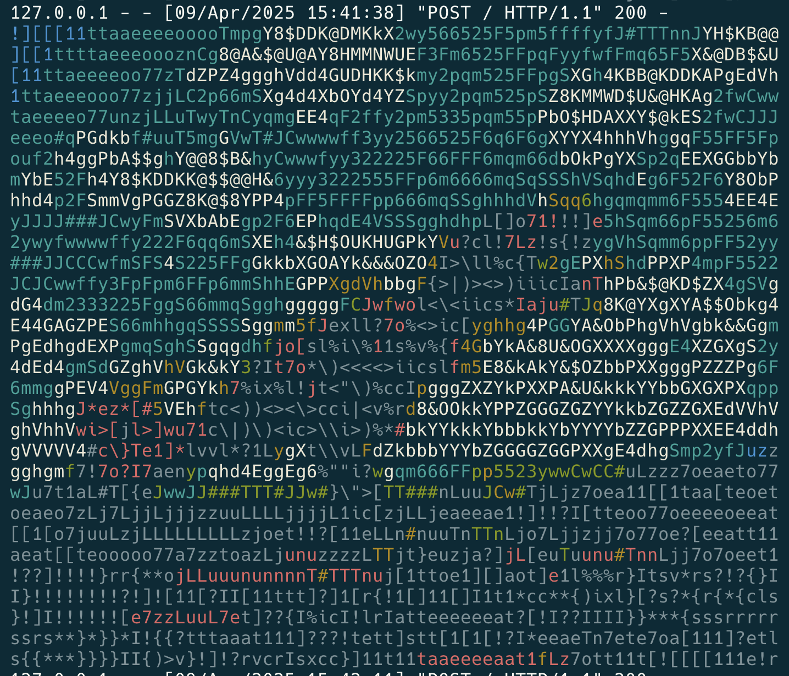

# 🎨 Generative ASCII Art

## Description
A simple, locally-hosted tool that allows a user to:

1. Input a prompt (on webpage)
2. Generate an image from that prompt
3. Convert that image to ASCII art, using ascii_magic
4. Convert that image to ASCII art, by mapping grayscale values
5. Compare the ASCII drawings (+ image)


## Setup

```sh
# Clone the repository
git clone https://github.com/aadriien/generative-ascii-art.git

# Navigate to the project directory
cd generative-ascii-art

# Install dependencies and run setup
make setup

# Open the webpage and experiment!
http://127.0.0.1:5000
```

## Acknowledgements
I used [Pollinations.AI](https://pollinations.ai)'s open source API endpoint to generate the image from prompt. Thanks Pollination.AI!


## Example Images





